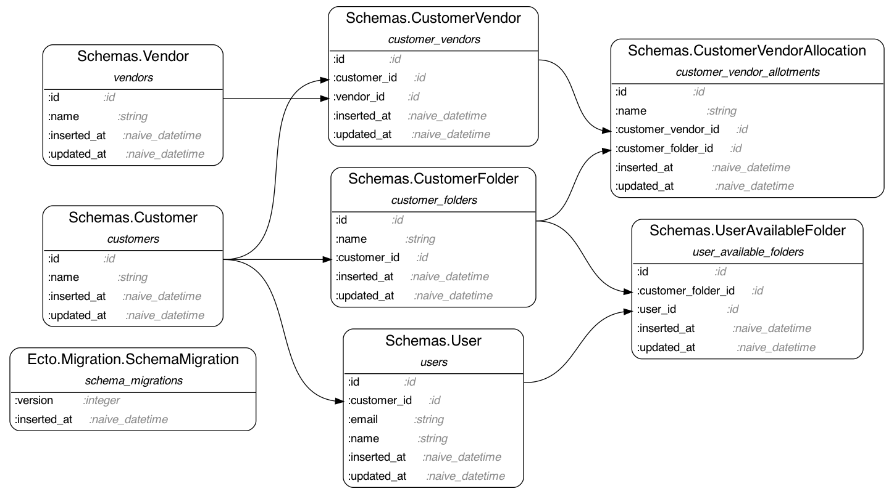

# RrCodeChallenge

## Noah's Notes

ERD

Aside from the code changed in the actual API code, there was a bug in the test factory on line 88 of [test/portfolio_management_test.exs](./test/portfolio_management_test.exs) where the seeded test user wasn't being properly related to the customer.

Given the original description of the domain/schemas, there are not many schema changes I would propose. Initially the idea of a user being tightly coupled to a customer seemed odd, especially if it would ever be possible for a single user to belong to be a member of multiple customers. That was not outlined though, so decoupling the two might be a moot point.

There is an existing test for "assert user can't get access to another customer's folder", but there should probably also be a test for "assert user can't get access to a customer folder where they are part of the customer but don't have access to that particular folder".

# Original README

Instructions For Challenge

- There are currently 5 failing tests in test/portfolio_management_tests.exs
- Your Job is to adjust the functions in portfolio_management.ex so these all pass.
- Are there any changes you'd make to the schema structure? Any additional tests you think would be valuable?

Domain Information/Terminology:

- Customers - a company that users our product
- Portfolio - This isn't represented in a db table, but it is the collective list of vendors that are related to a given customer.
- User - individual user, belongs to a customer
- Vendor - a separate company that does not directly interact with the product, but can belong to one or many customers' portfolios.
- CustomerVendor - This is a join table when a vendor belongs in a customers' portfolio.
- CustomerFolder - This describes a categorization that customers can define as a way of grouping their vendors in their portfolio.
- CustomerVendorAllocation - Join table - when a customer's vendor has been categorized into a customer's folder. Customer Vendor's can belong in many different folders.
- UserAvailableFolder - Another Join table - this one is between Customer Folder and User. It depicts the folders a user has access to, which subsiquently determine the vendors they have access to.
